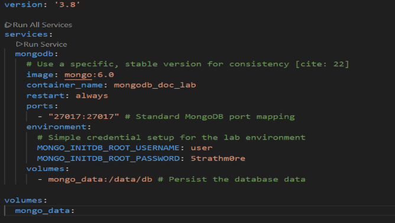
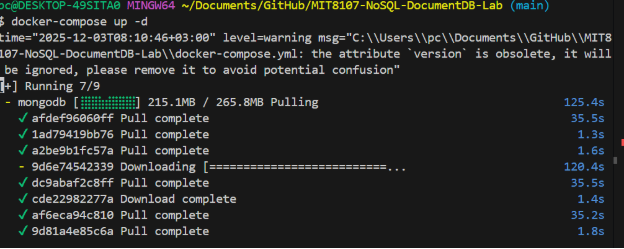
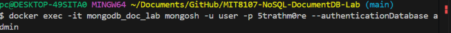
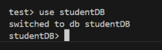
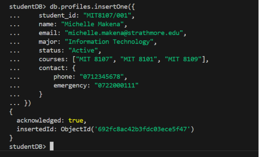
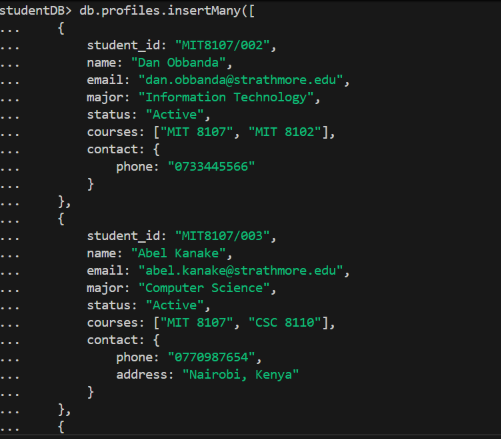
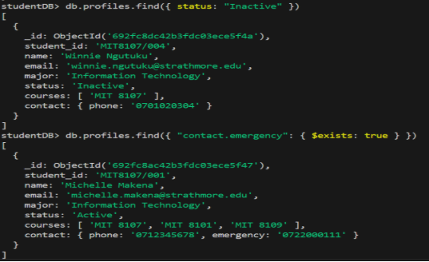
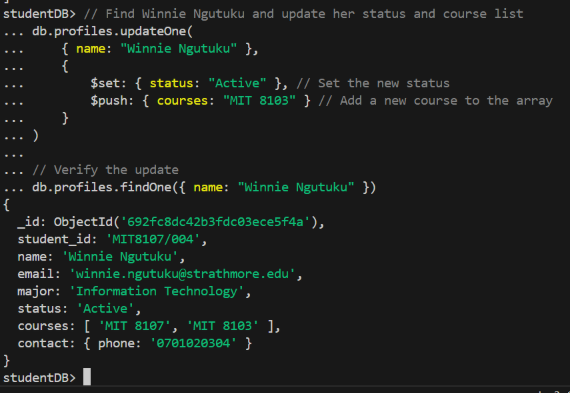
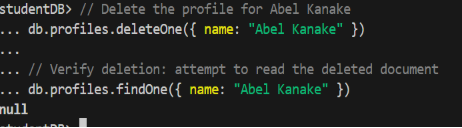
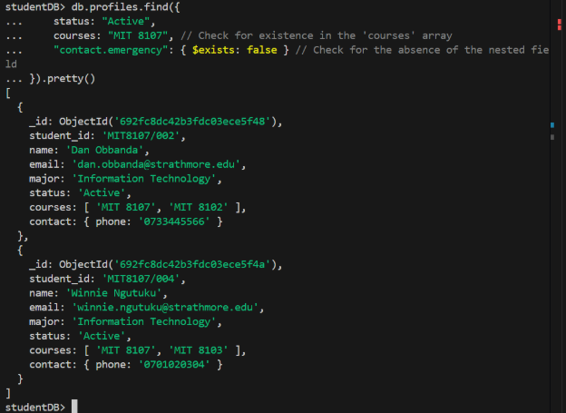

**Lab Manual: Introduction to the Document Data Model (MongoDB)**

**98283: Mark Murungi Mwenda**

|**Unit Code**|**Assignment**|**Data Model**|**Database System**|
| :- | :- | :- | :- |
|MIT 8107 |Continuous Assessment Test (CAT) |Document Data Model |MongoDB 6.0|

**1. Objectives **

Upon successful completion of this lab, the user will be able to:

1. **Install & Configure** a MongoDB instance using Docker.
1. **Execute** fundamental **CRUD** operations (Create, Read, Update, Delete) on MongoDB collections.
1. **Model** a realistic application scenario (e.g., Student Records) using the document data structure.
1. **Query** data effectively using nested fields and array structures.
-----
**2. Prerequisites and Environment Setup** 

To complete this lab, you must have the following tools installed and operational on your local machine:

- **Docker Engine** (or Docker Desktop).
- **Docker Compose** (usually included with Docker Desktop).
- A basic understanding of JSON/BSON structure.

2\.1 MongoDB Installation via Docker Compose 9

We will use Docker Compose for a consistent and reproducible setup.

**Step 1: Create the Docker Compose File**

Create a file named docker-compose.yml and add the following configuration.

**Step 2: Launch the Database Container**

Execute the following command in the same directory as the docker-compose.yml file:

**Step 3: Access the MongoDB Shell**

Once the container is running, access the mongosh interactive shell inside the container:

You are now connected to the MongoDB server and ready to proceed.

**3. Basic CRUD Operations and Sample Data** 

We will demonstrate Create, Read, Update, and Delete operations using a sample database called productDB and a collection called electronics.

3\.1 Create (C) - Inserting Data

First, switch to the target database. MongoDB will create it on the first insertion.

Insert a single document:

Insert multiple documents:

3\.2 Read (R) - Retrieving Data

3\.3 Update (U) - Modifying Data 

Update Winnie Ngutuku's status to "Active" and add a new course.

3\.4 Delete (D) - Removing Data 

Remove Abel Kanake's profile.

**4. Applied Scenario: Complex Student Profile Querying ⚙️**

**Scenario:** Find all **"Active"** students enrolled in **"MIT 8107"** who are **missing** the **contact.emergency** field. This highlights querying nested fields and array elements.

4\.1 Executing the Complex Query

